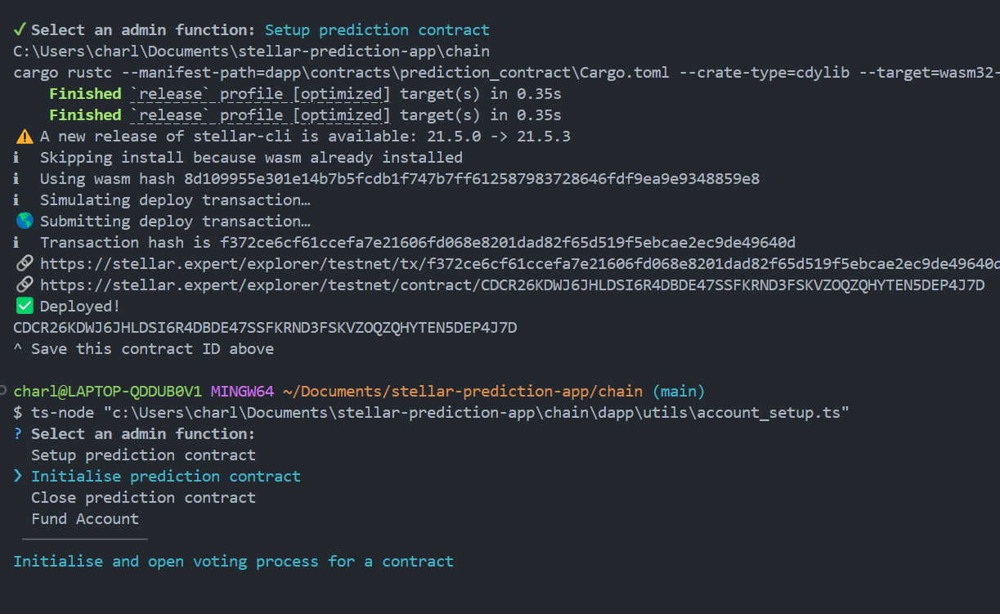

# The Betting Bazaar
A simple Astro dapp letting you bet on stuff that might happen.

## Project Structure

- The frontend is contained in `/dapp`, which houses the entire Astro project. Navigate into that directory before opening a console to run it.
- The landing page is contained in a `index.astro` component and contains no JavaScript.
- Astro components are held in `/dapp/components` and will be HTML-only at runtime by default. Content in the script tags will be JS ran in the browser.
- Scripts and state holders are contained in `/dapp/utils`, and will include the main contract invocation functions.
- In [.env.example](./.env.example), you'll see the IDs of the deployed contracts in use, as well as a testing account and network addresses. In production use, these should be reconfigured.

---
<!-- The following is the Frontend Template's README.md -->

# Getting Started

Clean node modules:
- run `npm rm -r node_modules`
- run `npm cache clean --force`
- run `npm install`

- `cp .env.example .env`
- `npm run dev`

You need to have [stellar-cli](https://developers.stellar.org/docs/build/smart-contracts/getting-started/setup#install-the-stellar-cli) set up on your end to interact with the testnet.
This dapp also requires the [Freighter](https://www.freighter.app/) wallet extension for users to sign transactions.

# Admin Setup

Each prediction market is a contract that must be deployed and initalised by an admin account. The initialisation
script will add a new entry in [markets.json](src/data/markets.json).
- configure admin keypair in `.env`.
- run the [utils/account_setup.ts](utils/account_setup.ts) script in a bash terminal.

